# Ejercicio - Temas 07-08
## Integración Avanzada de Multimedia en el Portfolio Profesional

**Alumno:** Victor Tuesta Ascoy
**Curso:** Diseño de Interfaces Web
**Fecha de entrega:** 24-11-2025

---

## 📋 Descripción General

Este ejercicio implementa la integración avanzada de elementos multimedia (audio y video) en el portfolio profesional, utilizando HTML5, CSS3, JavaScript y componentes Bootstrap para crear una experiencia de usuario enriquecida y profesional.

## 🎵 Formatos Multimedia y Compatibilidad

### Formatos de Audio
- **MP3** - Compatibilidad universal
- **OGG** - Alternativa de código abierto

### Formatos de Video
- **MP4 (H.264)** - Máxima compatibilidad
- **WebM (VP9)** - Compresión optimizada
- **OGG (Theora)** - Soporte para sistemas Linux

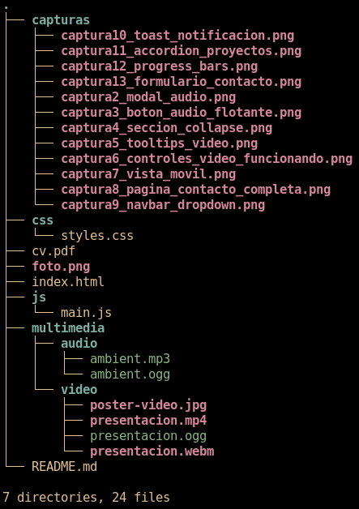

## ⚙️ Configuración de Reproducción

### Audio de Fondo
- Reproducción en bucle (loop)
- Activación mediante consentimiento explícito
- Botón flotante de mute/unmute

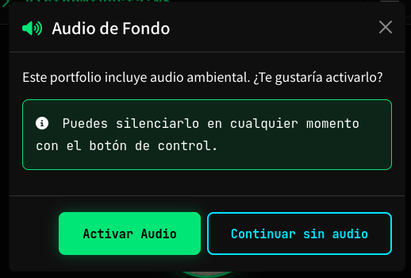
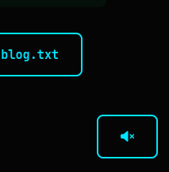

### Video de Presentación
- Imagen de portada personalizada
- Reproducción bajo demanda
- Controles nativos + personalizados

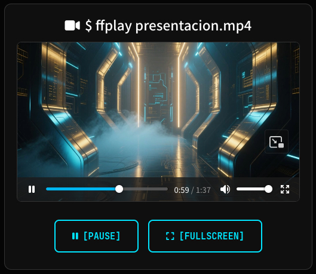

## 🚀 Componentes Bootstrap Implementados

### Componentes Principales (Requeridos)
- **Modal** - Consentimiento de audio
- **Collapse** - Información técnica expandible
- **Tooltips** - Descripciones en controles

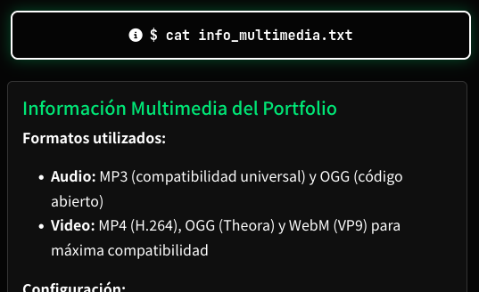
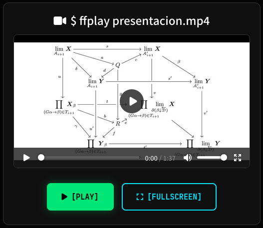

### Componentes Adicionales
- **Navbar** - Navegación responsive con dropdown
- **Toast** - Notificación de bienvenida
- **Accordion** - Proyectos desplegables
- **Progress Bars** - Habilidades con porcentajes
- **Cards** - Proyectos y formularios
- **Forms** - Validación de contacto
- **Badges** - Etiquetas de tecnologías
- **Alerts** - Mensajes de feedback

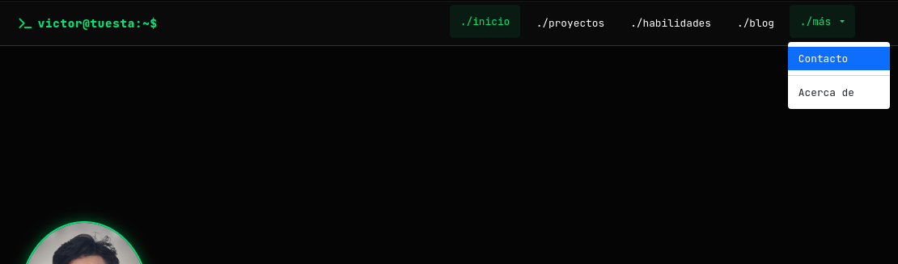
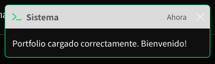
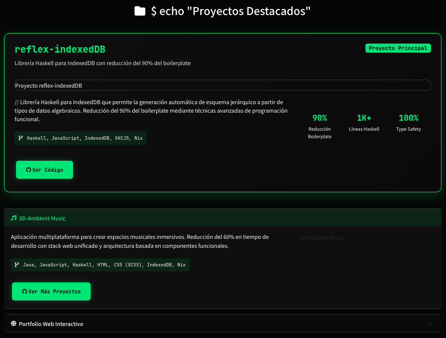
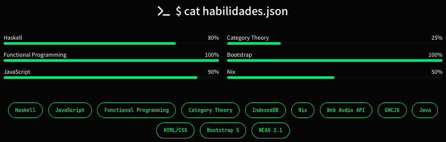

## 🎮 Controles Multimedia Personalizados

### Audio
- Botón flotante mute/unmute
- Cambio dinámico de iconos
- Tooltips informativos

### Video
- Botones [PLAY]/[PAUSE] personalizados
- Control de pantalla completa
- Sincronización con controles nativos

## 🛠️ Desafíos Técnicos y Soluciones

### Problema 1: Políticas de Autoplay
**Solución:** Modal de consentimiento que activa audio solo tras interacción del usuario

### Problema 2: Compatibilidad Cross-Browser
**Solución:** Múltiples formatos con fallback automático mediante `<source>`

### Problema 3: Experiencia Móvil
**Solución:** Diseño responsivo y compresión optimizada

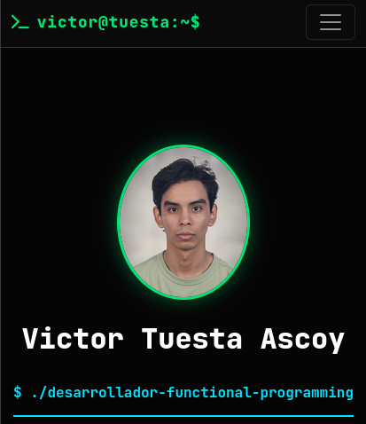

## ♿ Accesibilidad y UX

### Mejoras Implementadas
- Controles de teclado funcionales
- Textos alternativos descriptivos
- Contraste adecuado en controles
- Focus states visibles
- Todas las funcionalidades opcionales

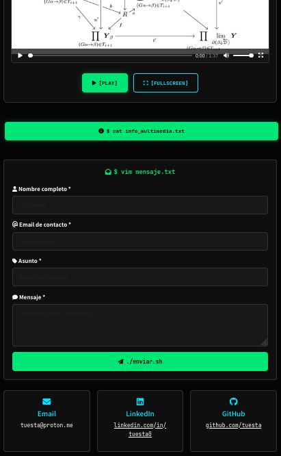

## 📁 Archivos Entregados

```
portfolio/
├── index.html
├── foto.png
├── cv.pdf
├── README.md
├── css/
│   └── styles.css
├── js/
│   └── main.js
├── multimedia/
│   ├── audio/
│   │   ├── ambient.mp3
│   │   └── ambient.ogg
│   └── video/
│       ├── presentacion.mp4
│       ├── presentacion.webm
│       ├── presentacion.ogg
│       └── poster-video.jpg
└── capturas/ (13 capturas PNG)
```

---

## ✅ Conclusión

Se han implementado todas las especificaciones requeridas, creando una integración multimedia profesional que mejora la experiencia de usuario sin resultar intrusiva. El portfolio funciona consistentemente en todos los navegadores y dispositivos, demostrando un dominio avanzado de las tecnologías web multimedia.

**Formulario de contacto con validación:**
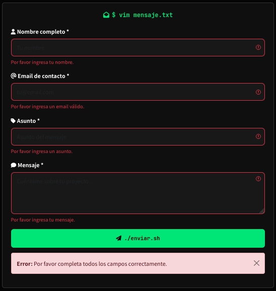
